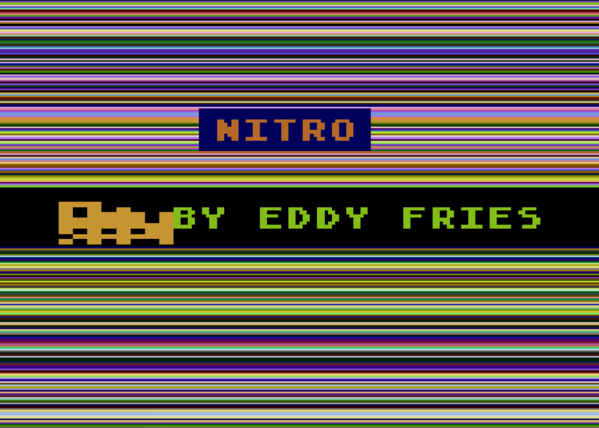
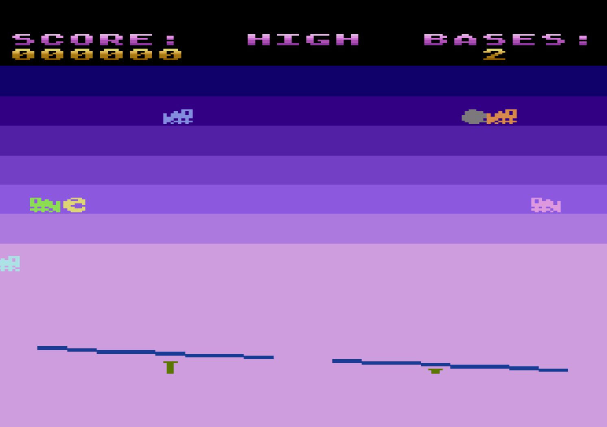
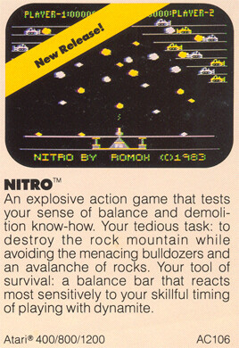

# edfries-nitro
Nitro game by Ed Fries for Atari 8-bit computers

An unreleased, unfinished game for Atari 8-bit computers, by Ed Fries. Coded in 6502 assembly language with the Mac/65 assembler. 

This was to be published by Romox but the company folded before Ed could finish the game.

The XFD file is the canonical source, in an Atari disk image format, from Ed. The .src files were exported by me (Kay Savetz) for easier reading on modern computers.

Ed has released this code under the MIT License. 

